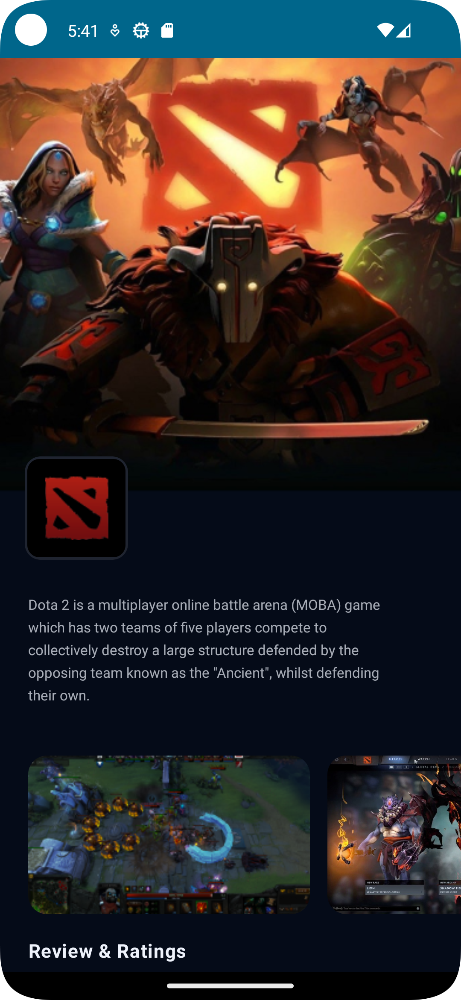

# Android-Test-Project  
Just a layout using Android for "Mobile app development" courses.  
The application is a WIP for this project: https://www.figma.com/file/8AeQGXA4dwLaboZzj4EQ7D/Android?node-id=1834%3A127&mode=dev  

You can try it out here:  
https://drive.google.com/file/d/19pwYmxbF56Ao7T1pkRECpVVzlZRXbUkp/view?usp=sharing  

What's done:  
-The very basic details of the application, including banner, logo, video previews and install button  
-Learnt some basics on Android app development  

